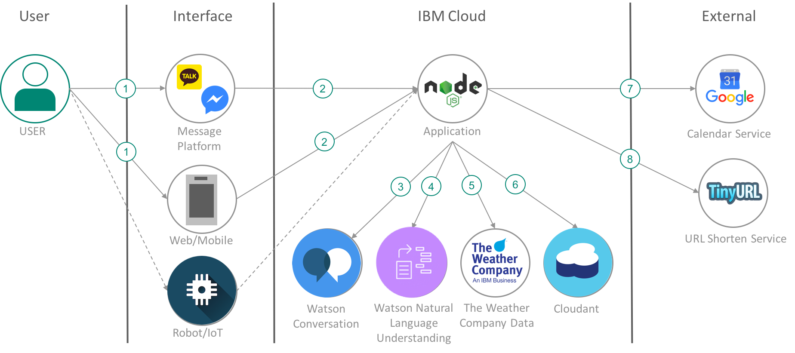

# IBM Watson을 활용한 AI 비서 - 캘린더봇

*Read this in other languages: [English](README-en.md).*

이 애플리케이션은 IBM Watson Conversation을 활용하고자 하는 개발자를 위해 개발되었습니다. 이 애플리케이션은 "오늘 뭐하지?" 라는 단순한 질문에 대한 아이디어에서 시작하였으며 IBM Watson Natural language Understanding 및 The Weather Company Data를 활용하여 사용자의 최근 액티비티, 날씨 정보 등을 기반으로 사용자에게 오늘 할 수 있는 활동을 추천합니다.

이 애플리케이션은 [Conversation Simple](conversation_simple)을 기반으로 수정하여 개발했으며 [데모 링크][demo_url]에서 테스트할 수 있습니다. 혹은 카카오톡 플러스친구 ``캘린더봇``을 추가하여 테스트할 수 있습니다.

이 애플리케이션의 구성을 이해하고 튜토리얼을 마치면 다음을 이해할 수 있습니다.
* Node.js 기반의 챗봇 애플리케이션 개발
* IBM Watson Conversation을 활용하여 챗봇 빌드
* IBM Watson Natural Language Undersatanding 및 The Weather Company Data 서비스를 애플리케이션에서 활용
* 구글 캘린더 API 및 tinyurl의 Url Shorten 기능을 애플리케이션에서 사용

    

## Flow
1. 사용자는 다양한 인터페이스를 통해 캘린더봇을 사용합니다. 실습 과정에서는 웹 애플리케이션 및 카카오톡 메신저 플랫폼을 사용합니다.
1. 모든 인터페이스는 사용자와 애플리케이션 사이의 매개체 역할을 합니다. 사용자의 메세지를 애플리케이션에 전달하고 응답을 다시 사용자에게 전달합니다.애플리케이션은 Node.js 런타임 기반으로 개발되었습니다. 애플리케이션은 필요한 기능을 수행하기 위해 다른 서비스들을 호출하거나 자체적인 로직을 수행합니다.
1. 애플리케이션은 사용자가 메세지를 전송할 때마다 Watson Conversation 서비스를 호출하여 이 다음에 수행할 로직 및 응답 메세지를 추출합니다.
1. 애플리케이션은 필요에 따라 Natural Language Understanding 서비스를 활용하여 텍스트로부터 메타데이터를 추출합니다. 이 애플리케이션은 사용자에게 오늘 하면 좋은 액티비티를 추천하기 위해 사용자의 과거 캘린더 데이터를 조회 및 분석합니다.
1. 날씨 데이터를 얻기 위해 The Weather Company Data를 활용합니다. 사용자에게 액티비티를 추천할 때에 날씨의 영향을 받는 액티비티는 제외하기 위해 날씨 데이터를 활용합니다.
1. 사용자의 문맥 정보 및 로그를 클라우던트에 저장합니다.
1. 사용자의 일정을 조회 및 생성하기 위해 Google Calendar API를 사용합니다. 
1. 때로는 Google Calendar API를 사용할 때에 너무 긴 URL을 사용자에게 보여줄 필요가 있습니다. 이 경우를 대비해 TinyURL을 사용하여 짧은 URL을 사용하여 사용자에게 보여줍니다.

## 포함된 구성 요소
* [IBM Watson Conversation](https://www.ibm.com/watson/developercloud/conversation.html): 자연어를 이해하고 기계 학습(Machine learning)을 사용하여 고객과 소통할 때 사람이 하는 대화 방식으로 응답하는 어플리케이션을 만들 수 있도록 모든 기능을 제공해주는 서비스 입니다.

* [IBM Watson Natural Language Understanding](https://www.ibm.com/watson/developercloud/natural-language-understanding.html): 텍스트를 분석하여 컨텐츠로부터 컨셉, 엔티티, 키워드, 카테고리, 긍부정, 감정, 관계 등과 같은 메타데이터를 추출하는데에 활용할 수 있는 서비스입니다.

* [The Weather Company Data]

## 사용된 기술
* [Node.js](https://nodejs.org/): 자바스크립트 기반의 런타임으로 확장성 있는 애플리케이션을 개발할 수 있습니다.

* [Google Calendar API](https://developers.google.com/google-apps/calendar/) : 구글 캘린더와 연동하기 위한 API를 제공합니다.

* [tinyurl](https://www.npmjs.com/package/tinyurl) : 간편한 URL Shorten API를 제공합니다.

# 실습

1. [사전 준비 사항](#사전-준비-사항)을 먼저 완료하십시오.
1. 애플리케이션을 [IBM Cloud에 바로 배포](#1-ibm-cloud에-배포하기)하거나 [로컬에서 실행](#2-로컬에서-실행하기)합니다.
1. [Conversation의 워크스페이스를 설정](3-Conversation의-Workspace-설정-및-IBM-Cloud-환경-변수-설정)하고 애플리케이션에 필요한 환경 변수를 수정합니다.
1. [Watson Conversation Tool 실습](#4-Watson-Conversation-Tool-실습)을 통해 챗봇을 완성합니다.
1. 챗봇을 [카카오톡과 연동](#4-카카오톡과-연동하기)합니다.

## 사전 준비 사항

* IBM Cloud의 계정을 생성합니다.
    * IBM Cloud에서 [새로운 계정을 생성](https://ibm.biz/BdZx6e)하거나 갖고 계신 계정을 사용하십시오. 계정에 256MB의 앱을 실행하고 5개 이상의 서비스를 생성할 수 있는 가용 공간이 있어야 합니다.
* (선택) 애플리케이션을 로컬에서 실행하려면 Node.js 런타임 및 npm 패키지 매니저를 설치합니다.:
    * [Node.js 런타임 및 npm 패키지 매니저 설치](https://nodejs.org/#download)
* (선택) 로컬에서 변경한 애플리케이션을 IBM Cloud에 배포하려면 CLI(Command Line Interface)를 설치합니다.
    * [IBM Cloud CLI 설치](http://clis.ng.bluemix.net/)
* 이 애플리케이션은 Google Calendar API를 사용합니다. 
    * [Google API 콘솔에서 프로젝트 생성](https://console.developers.google.com/flows/enableapi?apiid=calendar&authuser=0)
        - ``계속`` 버튼을 누른 후 ``사용자 인증 정보로 이동`` 버튼 클릭하면 ``사용자 인증 정보``페이지가 오픈됩니다. 이 화면에서 ``취소`` 버튼을 누릅니다.
        - 화면 상단의 ``OAuth 동의 화면``탭을 클릭합니다. ``사용자에게 표시되는 제품 이름``을 입력하고 저장합니다.
        - ``사용자 인증 정보``탭에서 ``사용자 인증 정보 만들기`` 버튼을 클릭하여 ``OAuth 클라이언트 ID``를 선택합니다.
        - 애플리케이션 유형으로 ``기타``를 선택하고 이름에 ``Tutorial``을 입력합니다. ``생성`` 버튼을 누릅니다.
        - 팝업에서 클라이언트 ID와 Password를 복사하여 기록해둡니다.
        - 팝업을 종료하고 ``JSON 다운로드`` 아이콘을 클릭하여 JSON을 다운로드 합니다. 이 파일을 소스코드의 루트 폴더에 client_secret.json으로 저장합니다.
* 카카오톡과 챗봇을 연동하려면 카카오톡 플러스친구를 생성하십시오.
    * [카카오톡 플러스 친구 생성](https://center-pf.kakao.com)
* 애플리케이션의 소스코드를 다운로드 합니다.
    * [소스코드 레파지토리](https://github.com/hjjo/chatbot-sample)에서 ``Clone or download`` 버튼을 통해 다운로드 하십시오. git 사용자의 경우 git client를 통해 clone하거나 folk합니다.

## 1. IBM Cloud에 배포하기
<b>[이 링크를 클릭하여 애플리케이션을 IBM Cloud에 배포합니다.](https://bluemix.net/deploy?repository=https://github.com/hjjo/chatbot-sample.git)</b>

애플리케이션 배포가 시작되면 [3. Conversation의 Workspace 및 IBM Cloud 환경 변수 설정](#3-conversation의-workspace-및-ibm-cloud-환경-변수-설정)을 시작하십시오. 

이 링크를 통한 애플리케이션 배포에 어려움이 있는 경우 [2.로컬에서 실행하기](#2-로컬에서-실행하기)의 방법으로 애플리케이션을 배포합니다.

## 2. 로컬에서 실행하기

**(이 단계는 이번 실습 세션에서는 진행하지 않으셔도 됩니다. 1번을 통해 배포를 완료하신 경우 3번으로 가십시오.)**

이 앱을 베이스로 하여 수정 및 새로운 앱을 개발하고자 하는 경우 로컬에 설치할 수 있습니다. 수정한 앱 버전을 다시 IBM Cloud로 배포할 수 있습니다.

### 2.1 필요한 서비스 생성
[IBM Cloud 카탈로그](https://console.bluemix.net/catalog) 또는 CLI 명령을 통해 다음의 서비스를 생성합니다. 서비스 이름은 manifest.yml에 명시되어 있기에 반드시 같은 이름으로 생성해야 배포가 가능합니다. 

| 서비스 카탈로그상 이름 | 서비스 타입명 | 플랜 | 서비스 이름 |
| :---: | :---: | :---: | :---: |
Conversation | conversation | free | conversation-service
Natural Language Understanding | natural-language-understanding | free | natural-language-understanding-service
Cloudant NoSQL DB | cloudantNoSQLDB | Lite | cloudant-service

#### 카탈로그 UI에서 서비스 생성하는 방법
[IBM Cloud 카탈로그](https://console.bluemix.net/catalog)에서 ``서비스 카탈로그상 이름``으로 서비스를 검색합니다. 
서비스 이름은 반드시 표를 참조하여 입력하십시오.

#### CLI 명령으로 서비스 생성하는 방법

(중요) 커맨드 창을 열어 소스코드의 프로젝트 루트 경로로 이동합니다.

CLI를 통해 서비스를 생성하는 경우 먼저 다음 명령을 참조하여 로그인 하십시오. 자세한 내용은 [링크](https://console.bluemix.net/docs/cli/reference/bluemix_cli/bx_cli.html#bluemix_login)를 참조하세요.
> bx login [-a api_endpoint]

api_endpoint의 url은 리전별로 다릅니다.

    US South : api.ng.bluemix.net
    UK : api.eu-gb.bluemix.net
    Sydney : api.au-syd.bluemix.net

만약 US South를 사용한다면 다음 명령을 사용하면 됩니다.
> bx login -a api.ng.bluemix.net

다음 명령을 통해 애플리케이션을 배포할 조직과 스페이스를 설정합니다. ORG에는 조직 이름을, SPACE에는 스페이스 이름을 입력하십시오. 자세한 내용은 [링크](https://console.bluemix.net/docs/cli/reference/bluemix_cli/bx_cli.html#bluemix_target)를 확인하십시오.
> bx target --cf

이제 서비스와 서비스 키를 각각 생성합니다. 

/scripts/install.sh 스크립트를 활용하여 한번에 생성하거나
> sh scripts/install.sh

또는 아래 명령을 활용하여 수동으로 생성하십시오.
> bx service create <서비스 타입명> <플랜> <서비스 이름>
> bx service key-create <서비스 이름> <키 이름>

### 2.2 로컬에서 실행
**(이 단계는 이번 실습 세션에서는 진행하지 않으셔도 됩니다. 2.1번을 완료하신 경우 2.3번으로 가십시오.)**

로컬에서 실행하려면 환경 변수를 셋팅해야 합니다. 예제 파일로부터 환경 변수를 저장할 파일을 생성합니다.
> cp .env.example .env

.env 파일의 환경변수를 각 서비스의 Credential 값으로 채워줍니다.

앱을 설치하고 실행합니다.
> npm install
> npm start

### 2.3 IBM Cloud에 배포

`<project_root>/manifest.yml`에서 애플리케이션 이름을 변경합니다. 애플리케이션 이름은 IBM Cloud 내에서 Unique한 값이어야 합니다. 아래와 같이 날짜와 이니셜을 더해 겹치지 않도록 설정합니다.

<pre>
applications:
- name: connectbot-2017-1109-hjjo
</pre>

다음 명령으로 앱을 IBM Cloud에 배포합니다.
> bx app push

## 3. Conversation의 Workspace 및 IBM Cloud 환경 변수 설정

1. IBM Cloud의 [대시보드](https://console.bluemix.net/dashboard)에 접속합니다. 애플리케이션 배포시 설정했던 Region, Organization 및 Space를 올바르게 선택합니다.
1. 서비스 목록에서 conversation-service를 선택합니다.
1. ``Launch Tool`` 버튼을 눌러 **Conversation Tool**을 오픈합니다. 이 링크를 기억해 두십시오. 
1. Conversation Tool에서 ``Import a workspace`` 아이콘을 선택하십시오. 아래와 같이 생겼습니다.

    

1. 애플리케이션 소스코드의 /training/calendar_bot_workspace.json 파일을 선택합니다.
    
    `<project_root>/training/calendar_bot_workspace.json`
1. ``Everything (Intents, Entities, and Dialog)``를 선택하고 ``Import`` 버튼을 눌러 워크스페이스를 생성합니다.
1. 좌측의 Workspaces 아이콘을 눌러 워크스페이스 목록으로 돌아갑니다.

    

1. 생성된 워크스페이스의 카드 우측 상단에 위치한 아이콘을 눌러 ``View Details``를 선택합니다.

    

1. ``Workspace ID``를 복사하여 기록해 둡니다.
1. IBM Cloud의 [대시보드](https://console.bluemix.net/dashboard)에서 애플리케이션을 선택합니다. ROUTE가 아닌 NAME 부분을 클릭하십시오.
1. 좌측 메뉴에서 ``Runtime``을 선택합니다.
1. ``Environment Variables`` 탭을 선택하고 스크롤을 아래로 내립니다. User Defind라고 명시된 환경변수 항목들이 보입니다. 이 항목들 중에서 WORKSPACE_ID의 VALUE 값을 위에서 복사해둔 값으로 변경합니다.

### 3.2 구글 캘린더 API 설정
애플리케이션 대시보드의 Runtime 페이지에 있는 ``Environment Variables`` 탭에서 계속 진행하십시오.
1. GOOGLE_CLIENT_ID, GOOGLE_CLIENT_SECRET의 VALUE 값을 사전 준비사항에서 기록해둔 값으로 변경합니다.
1. 저장 버튼을 눌러 변경한 환경변수 값을 저장합니다.

### 3.3 애플리케이션 재시작
애플리케이션 대시보드에서 변경한 환경 변수를 반영하기 위해 애플리케이션을 재시작 하십시오. 
상단의 재시작 아이콘을 눌러 재시작할 수 있습니다.

    

### 3.4 애플리케이션 실행
``Routes`` 버튼을 클릭하여 애플리케이션 URL을 확인하고 브라우저에서 접속합니다.

## 4. Watson Conversation Tool 실습

위 단계에서 Import한 /training/calendar_bot_workspace.json 파일은 이 애플리케이션의 주요 기능중 하나인 schedule 추가 기능을 직접 개발하도록 의도된 워크스페이스 입니다. Import한 워크스페이스를 시작점으로 하여 캘린더 봇을 완성해 봅니다.

이 단계는 **Conversation Tool**에서 진행합니다. **Conversation Tool**을 다시 오픈하려면 다음 단계를 따르십시오. 챗봇 프로젝트에서 **Conversation Tool**은 자주 사용하게 되므로 링크를 즐겨찾기 하십시오.

1. IBM Cloud의 [대시보드](https://console.bluemix.net/dashboard)에 접속합니다. 애플리케이션 배포시 설정했던 Region, Organization 및 Space를 올바르게 선택합니다.
1. 서비스 목록에서 conversation-service를 선택합니다.
1. ``Launch Tool`` 버튼을 눌러 **Conversation Tool**을 오픈합니다.

**Conversation Tool**에서 캘린더봇 워크스페이스를 오픈합니다.

### 4.1 Intent 추가 
캘린더봇 워크스페이스에서 ``Intents`` 탭을 선택합니다. ``Create new`` 버튼으로 새로운 인텐트를 생성할 수 있습니다. csv파일로부터 Import하거나 Export할 수도 있습니다. 

캘린더봇에 schedule_add 인텐트를 추가합니다.
1. 직관적으로 ``일정 추가해줘``라고 말할 수도 있고 간접적으로 ``금요일에 영화 예매해놨어 남친이랑 볼꺼야``라고 말할 수도 있습니다.
1. 캘린더 봇은 직관적이던 간접적이던 그 말의 목적이 ``스케줄의 추가`` 내지 ``스케줄의 기억``이라면 하나의 Intent로 정의할 수 있습니다. ``창문 좀 닫아줘``와 ``좀 춥지 않아?``는 전혀 다른 의미이지만 상황에 따라서 같은 Intent가 될 수도 있습니다.
1. 인텐트 이름으로 ``schedule_add``를 입력합니다. 최소 20개 이상의 사용자 메세지 예시를 입력하십시오.
1. 예시 : 
        * 내일 업체랑 미팅 있어
        * 일정 추가해줘
        * 스케줄 추가 해줘
        * 토요일에 회사 사람들이랑 등산가 ㅠ.ㅠ
        * 금요일 점심은 상무님이랑 먹기로 했어
        * 내일은 엄마, 아빠랑 집에서 저녁 먹을꺼야
        * 다음 주 수요일 친구랑 약속 있는데 추가좀
        * 오늘 저녁에 엄마랑 영화 보기로 했어
        * 다음주 토요일에 동창회가 잡혔네
1. 사용자의 메세지는 오타가 있을 수도 있고 띄어 쓰기, 맞춤법 등이 정확하지 않을 수도 있습니다. 이러한 것들이 모두 학습되어야 더 정확한 챗봇이 만들어질 수 있습니다.

### 4.2 Entity 추가
워크스페이스에서 ``Entities`` 탭을 선택합니다. ``Create new`` 버튼으로 새로운 엔티티를 생성할 수 있습니다. 

스케줄을 추가할 때에 사용하는 Entity 중에서 장소에 해당하는 place 엔티티를 생성합니다. 
1. 엔티티 이름으로  ``place``를 입력합니다.
1. 두 가지 방식으로 엔티티를 정의할 수 있습니다. 
    * Value Type으로 Synonims를 선택하면 해당 엔티티를 가리키는 단어들을 입력함으로써 엔티티를 정의할 수 있습니다. 이 방식은 많은 Value 값과 Synonim 값을 추가 해야 정확도있는 서비스를 제공할 수 있지만 머신러닝 기반이어서 후에 잘못 추출되거나 추출되지 않을 때에 재트레이닝을 통한 교정 및 추가가 가능합니다.
    * Value Type으로 Patterns를 선택하면 정규식을 사용하여 엔티티를 정의할 수 있습니다. 이 방식은 적은 노력으로 비교적 많은 엔티티를 추출할 수 있지만 룰 기반의 추출 방식이기에 트레이닝 및 교정은 불가능합니다.
1. 우리가 장소를 지칭할 때에 자주 사용하는 패턴은 ``~에서`` 입니다. 이 패턴을 정규식으로 추가합니다.
    * 예) 이번 송년회는 강남에서 한대
    * Value에 ``장소_패턴``을 입력하고 Type으로 ``Patterns``를 선택, ``Add patterns``란에 <pre>[가-힣]+에서</pre>를 입력합니다.
1. 하지만 ``~에서`` 표현을 항상 사용하는 것은 아닙니다. 자주 사용될 장소를 Synonims 방식으로 추가해 줍니다.
    * 예) 고등학교 동창 송년회 강남
    * Value에 ``핫플레이스``를 입력하고 Type으로 ``Synonims``를 선택, ``Add synonims``란에 ``홍대``, ``합정``, ``강남``, ``이태원``, ``명동`` 등을 입력합니다. 
    * Value에 ``자주 가는 곳``을 입력하고 Type으로 ``Synonims``를 선택, ``Add synonims``란에 ``집``, ``회사``등을 입력합니다. 
1. 오타, 줄임말로 인한 단어도 추가하면 정확도를 높일 수 있습니다.

### 4.3 Dialog 작성
워크스페이스에서 ``Dialog`` 탭을 선택합니다. ``Add node`` 버튼으로 새로운 노드를 생성할 수 있습니다. 다이얼로그는 사용자가 메세지를 보냈을 때, 사용자의 메세지로부터 인텐트 및 엔티티를 추출한 뒤에 챗봇의 응답을 설계하는 과정입니다. 이 과정은 룰 기반으로 이루어지며 구성된 노드를 위에서 아래로, 왼쪽에서 오른쪽으로 탐색하면서 조건(If bot recognizes)이 맞으면 해당 노드를 실행합니다.

shedule_add 인텐트에 대해 응답하는 다이얼로그를 작성합니다.
1. ``Add node`` 버튼으로 새로운 노드를 생성합니다.
1. ``If bot recognizes``에 #schedule_add를 입력합니다. (#은 인텐트를 가리키는 prefix입니다.)
1. 스케줄을 추가할 때에 필요한 값들을 사용자로부터 얻기 위해 Slot을 활성화 하는 단계입니다. Slot을 사용하면 필요한 값을 모두 얻었을 때에 해당 노드의 Response를 반환합니다.
    * 노드 구성 화면의 우측 상단에 있는 ``Customize`` 버튼을 눌러 Slot을 활성화 합니다. ``Prompt for everything ``체크박스를 선택합니다. 

        

    * 응답을 다양하게 설정하려면 ``Multiple responses``를 활성화 하십시오.
    * ``Apply`` 버튼을 누릅니다.
1. ``Then check for``에 Slot을 설정합니다.

    * 이 애플리케이션에서는 스케줄을 추가할 때에 Context로부터 다음의 값을 저장하여 사용합니다.

        | 필드 이름 | 필수 여부 |
        | :---: | :---: |
        $startDate | required |
        $endDate | optional |
        $startTime | optional |
        $endTime | optional |
        $people | required |
        $place | optional |
        $action | required |
        
    * 슬롯을 다음과 같이 설정하십시오. **If not present, ask** 필드를 입력하면 필수 항목, 입력하지 않으면 선택 항목으로 구분됩니다.

        | Check for | Save it as | If not present, ask |
        | :---: | :---: | :--- |
        @sys-date | $startDate | 언제 해당 일정이 있으세요? |
        @sys-date | $endDate |  |
        @sys-time | $startTime |  |
        @sys-time | $endTime |  |
        @people_pattern.literal | $people | 어떤 분과 만나세요? |
        @place.literal | $place |  |
        @action.literal | $action | 뭘 하실 예정이세요? |

1. 일부 슬롯에 대해서 사용자에게 값을 물었을 때 엔티티가 추출되지 않더라도 사용자 메세지 전체를 사용하여 값을 저장하도록 설정하는 단계입니다.
    * 해당 기능을 설정할 슬롯은 people과 action 입니다. 두 슬롯에 대해서 다음의 과정을 반복하십시오.
        * 설정하려는 슬롯 우측에 위치한 설정 버튼을 클릭합니다.

            

        * 팝업 우측 상단에 위치한 메뉴 아이콘을 선택하여 ``Enable conditional responses``를 선택합니다.

            

        * 스크롤을 내려 엔티티가 추출된 경우와 추출되지 않은 경우에 나누어 응답을 설정합니다.
            * ``Found``의 ``If bot reconizes`` 란에 ``true``를 입력합니다. ``Respond with`` 란에 ```\<? $people ?\> 만나시는군요.```를 입력합니다. (aciton 슬롯을 설정할 때에는 ```\<? $action ?\> 할 예정이시군요.``` 를 입력합니다.) 
            * ``Not found``의 ``If bot recognizes`` 란에 ``true``를 입력하고 우측에 위치한 설정 아이콘을 클릭합니다. ``Then respond with:``의 우측에 위치한 메뉴 버튼을 클릭하고 ``Open JSON editor``를 선택합니다. 다음의 JSON을 입력하여 사용자의 메세지 전체를 컨텍스트에 저장합니다.
                * people
                    ```
                        {
                            "conditions": "true",
                            "output": {
                                "text": {
                                "values": [
                                    "<? input.text ?> 만나시는 군요."
                                ],
                                "selection_policy": "sequential"
                                }
                            },
                            "context": {
                                "people": "<? input.text ?>"
                            }
                        }
                    ```
                * action
                    ```
                        {
                            "conditions": "true",
                            "output": {
                                "text": {
                                "values": [
                                    "<? input.text ?> 하실 예정이시군요."
                                ],
                                "selection_policy": "sequential"
                                }
                            },
                            "context": {
                                "action": "<? input.text ?>"
                            }
                        }
                    ```
1. 이제 전체 노드의 응답을 설계합니다. 이 응답은 필요한 Slot의 값을 모두 얻었을 때에 리턴됩니다. 노드 설정 화면에서 스크롤을 내려 ``Then respond with:``로 가십시오. 우측에 위치한 메뉴 아이콘을 클릭합니다. 다음 JSON을 입력하십시오.
    ```
        {
            "context": {
                "command": "add_event"
            },
            "output": {
                "text": {
                    "values": [
                        "$people $place $action 약속 일정 캘린더에 추가하겠습니다~"
                    ],
                    "selection_policy": "sequential"
                }
            }
        }
    ```
1. ``And finally`` 란은 ``Wait for user input``으로 유지하십시오.

노드 하나의 작성을 마쳤습니다. 전체 노드의 응답에서 context의 command 값으로 add_event를 저장했습니다. 애플리케이션은 이 명령을 확인하고 실제 캘린더에 이벤트를 저장합니다. 애플리케이션이 $data.add_event_result에 결과를 저장된 채로 하위 노드를 호출합니다. 이제 하위 노드를 작성합니다.

1. 이전 단계에서 작성한 노드의 메뉴 버튼을 눌러 ``Add child node를`` 클릭합니다.
1. 자식 노드의 ``If bot recognizes:`` 란에 ```$data and $data.add_event_result```를 입력합니다.
1. ``Then respond with:`` 란의 우측에 위치한 메뉴 아이콘을 눌러 ``Open JSON editor``를 클릭합니다.
1. 다음의 JSON을 입력하십시오.
    ```
        {
            "context": {
                "command": "finish"
            },
            "output": {
                "text": {
                "values": [
                    "일정이 추가됐어요 ~ <? $data.add_event_result ?>"
                ],
                "selection_policy": "sequential"
                }
            }
        }
    ```
1. ``And finally`` 란은 ``Wait for user input``으로 유지하십시오.

노드 작성이 완료되었습니다. 

### 4.4 워크스페이스 테스트

**Conversation Tool**의 우측 상단에 위치한 메세지 아이콘을 클릭하면 작성중인 워크스페이스를 테스트 할 수 있습니다.

### 4.5 캘린더봇 테스트
[이전 단계](#34-애플리케이션-실행)에서 방문했던 앱 url을 방문하여 테스트 하십시오. 캘린더봇에게 다음의 질문을 던져보세요.
* 오늘 뭐하지? (추천 기능은 오늘 아무런 일정도 없는 경우에만 실행됩니다. 이 기능을 테스트 하려면 구글 캘린더의 오늘 일정을 모두 삭제하신 후 진행하십시오.)
* 오늘 일정 알려줘
* 오늘 저녁에 엄마랑 집에서 홈쇼핑 하기로 했어
* 오늘 일정 알려줘

## 5. 카카오톡과 연동하기
이 애플리케이션은 이미 카카오톡과 연결하기 위한 API를 제공하고 있습니다. 카카오톡 플러스친구 관리자센터에서 설정 과정만 진행하면 됩니다. 
1. [플러스친구 관리자센터](https://center-pf.kakao.com/)에서 캘린더봇 용으로 생성한 친구를 선택합니다.
1. 좌측 메뉴에서 ``스마트채팅``을 선택합니다.
1. API형의 ``설정하기`` 버튼을 클릭합니다.
1. 앱 URL에 ``{애플리케이션 링크}/api/kakao``를 입력하고 ``API 테스트`` 버튼을 클릭합니다.
    * 예시) https://connectbot-2017.eu-gb.mybluemix.net/api/kakao
1. 나머지 항목은 적절하게 입력하십시오.
1. ``API형 저장하기`` 버튼을 클릭하여 저장합니다.
1. API형의 ``시작하기`` 버튼을 클릭합니다.

이제 카카오톡 메신저로 캘린더봇을 테스트할 수 있습니다.

* [주의] : 생성한 플러스친구를 카카오톡 메신저에서 검색하여 찾으려면 ``관리 > 상세설정 > 공개설정`` 에서 ``홈 공개`` 및 ``검색 허용``을 활성화 하십시오.
* [주의] : 구글의 캘린더 접근 권한 허용을 위한 링크는 카카오톡의 embedded webview에서의 실행을 허용하지 않습니다. 링크를 복사하여 별도의 브라우저에서 접속하십시오. (또한 모바일 프렌들리 하지 않으니 휴대폰을 가로모드로 놓고 사용하십시오.)

## 6. 페이스북 메신저와 연동하기
아직 지원되지 않으며 이번 실습에서 진행하지 않습니다.

## License

This sample code is licensed under Apache 2.0.
Full license text is available in [LICENSE](LICENSE).

## Contributing

See [CONTRIBUTING](CONTRIBUTING.md).

## Open Source @ IBM

Find more open source projects on the
[IBM Github Page](http://ibm.github.io/).


[conversation_simple]: https://github.com/watson-developer-cloud/conversation-simple
[cf_docs]: (https://www.ibm.com/watson/developercloud/doc/common/getting-started-cf.html)
[cloud_foundry]: https://github.com/cloudfoundry/cli#downloads
[demo_url]: https://calendarbot-201801.eu-gb.mybluemix.net/
[doc_intents]: (https://console.bluemix.net/docs/services/conversation/intents-entities.html#planning-your-entities)
[docs]: http://www.ibm.com/watson/developercloud/doc/conversation/overview.shtml
[docs_landing]: (https://console.bluemix.net/docs/services/conversation/index.html#about)
[node_link]: (http://nodejs.org/)
[npm_link]: (https://www.npmjs.com/)
[sign_up]: bluemix.net/registration